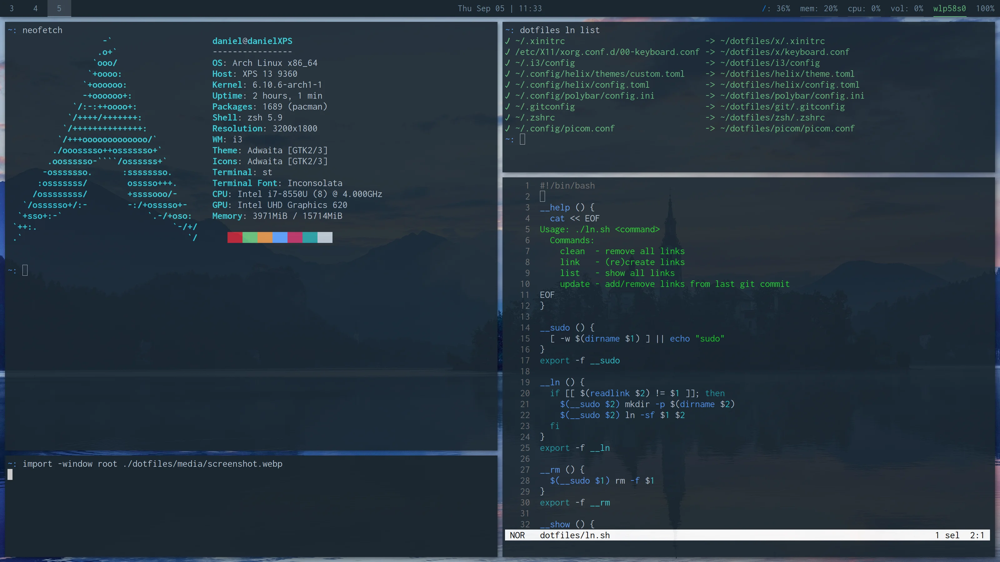

My dotfiles.

There's some unique wizardry which might be interesting:

## Symlinks

You'll notice a number of files have a first line similar to `# ln ~/some-path`.
[ln.sh](./ln.sh) scans these lines and uses them to create the appropriate
symlinks. Here's a [blog post](https://iamdan.me/better-dotfiles) with more
details.

## Shared X11/st colors

Previously colors were duplicated between the `st` and `x` configurations.

Now they're stored in one place as a C header file
([./colors.h](./colors.h)). They're imported in st and close enough to the
format required by `xrdb` that they can also be imported into x just by
stripping the quotes (see [./x/.xinitrc](./x/.xinitrc#L7-L8)).
